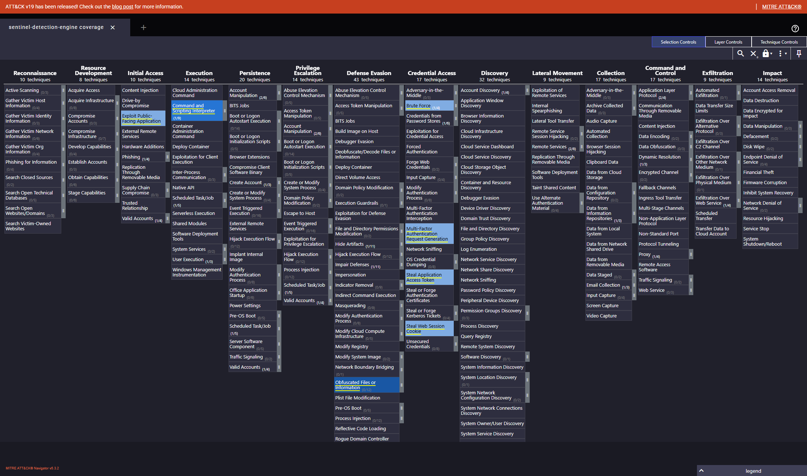
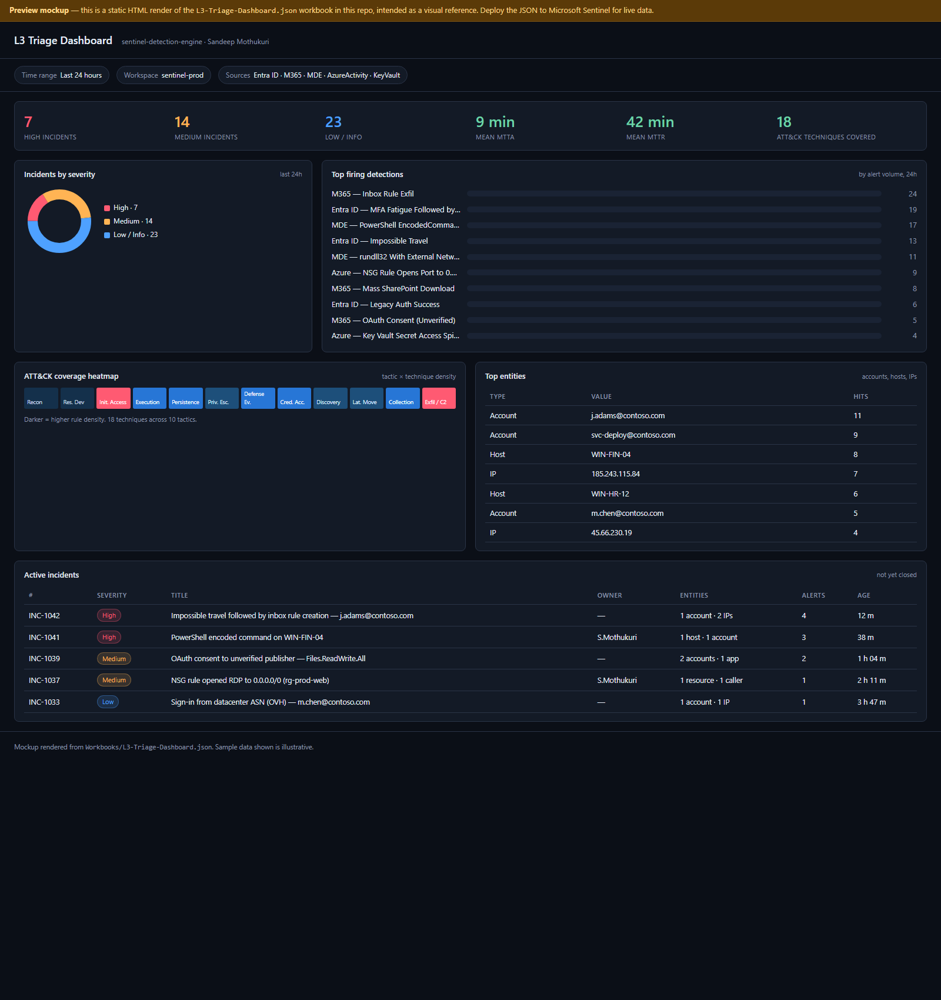

# sentinel-detection-engine

> Detection-as-code for **Microsoft Sentinel** — 12 analytic rules, 10 hunting queries, an L3 triage workbook, a Logic App playbook, ATT&CK Navigator coverage, and Atomic Red Team validation mapping. Every rule is CI-validated.

**Author:** Sandeep Mothukuri — SOC L3 / Incident Response
**Repo:** [`sandeepmothukuri/sentinel-detection-engine`](https://github.com/sandeepmothukuri/sentinel-detection-engine)

[](https://github.com/sandeepmothukuri/sentinel-detection-engine/actions/workflows/validate.yml)


---

## Preview

### ATT&CK coverage (MITRE Navigator)

Loaded into [MITRE ATT&CK Navigator](https://mitre-attack.github.io/attack-navigator/) from [`attack-navigator/layer.json`](attack-navigator/layer.json) — the layer is auto-generated from the rule YAML by [`scripts/generate_coverage.py`](scripts/generate_coverage.py).



### L3 Triage Dashboard (design preview)

Static render of [`Workbooks/L3-Triage-Dashboard.json`](Workbooks/L3-Triage-Dashboard.json) — KPIs, severity donut, top firing rules, ATT&CK density heatmap, top entities, and active-incident table. Deploy the JSON to Microsoft Sentinel for live data.



<details>
<summary>📷 Live Sentinel portal screenshots (added after I complete a tenant deployment via the <a href="docs/30-minute-walkthrough.md">30-minute walkthrough</a>)</summary>

The walkthrough produces these on a real M365 dev tenant + Azure free trial + MDE trial. Each is captured by running an Atomic Red Team test that fires the corresponding rule:

- `01-sentinel-overview.png` — Sentinel workspace overview
- `02-data-connectors.png` — Data connectors page with ≥ 4 connected sources
- `03-analytics-rules.png` — Analytics rules list with 12 deployed detections
- `05-incident-list.png` — Real incident from an Atomic Red Team test
- `06-investigation-graph.png` — Investigation entity graph
- `07-workbook-live.png` — Workbook running against live data

</details>

---

## Why this exists

Most public Sentinel content is either (a) a single hand-written query in a blog post, or (b) the full Microsoft community repo with thousands of rules and no curation. This pack sits in the middle: a **focused, curated set of high-signal detections** an L3 analyst would actually deploy on day one, with the engineering rigour (schema validation, ATT&CK mapping, ART tests) of a production detection-engineering team.

## What's inside

| Area | Count | Folder |
|---|---|---|
| Scheduled analytic rules | 12 | [`Detections/`](Detections/) |
| Hunting queries | 10 | [`Hunting Queries/`](Hunting%20Queries/) |
| Workbook (L3 Triage Dashboard) | 1 | [`Workbooks/`](Workbooks/) |
| Logic App playbooks (SOAR) | 4 | [`Playbooks/`](Playbooks/) |
| ATT&CK Navigator layer | 1 | [`attack-navigator/`](attack-navigator/) |
| Atomic Red Team mapping | 22 tests | [`tests/atomics.md`](tests/atomics.md) |
| Workflow documentation (IR runbook, triage SOP, escalation matrix, tuning log, SOAR flow, maturity assessment) | 6 | [`docs/workflows/`](docs/workflows/) |
| CI workflows (validate, PR diff report, release) | 3 | [`.github/workflows/`](.github/workflows/) |
| Sigma → KQL converter | 1 | [`scripts/sigma_to_kql.py`](scripts/sigma_to_kql.py) |

### Coverage snapshot

- **Tactics covered:** Initial Access, Execution, Persistence, Privilege Escalation, Defense Evasion, Credential Access, Discovery, Collection, Command & Control, Exfiltration
- **Techniques covered:** 18 unique ATT&CK techniques (see [`coverage.md`](coverage.md))
- **Data sources:** Microsoft Entra ID, Microsoft 365 (Exchange, SharePoint, OAuth), Microsoft Defender for Endpoint, Azure Activity, Azure Key Vault

## Rules at a glance

### Identity & Cloud Identity (Entra ID)
- `EntraID_ImpossibleTravel.yaml` — geo-distance + time-delta sign-in correlation
- `EntraID_MFAFatigue.yaml` — repeated MFA prompts followed by success
- `EntraID_LegacyAuthSuccess.yaml` — successful auth over legacy protocols
- `EntraID_ServicePrincipalCredAdd.yaml` — credential added to SP outside CI/CD allow-list

### Microsoft 365
- `M365_InboxRuleExfil.yaml` — auto-forward / delete inbox rule creation
- `M365_MassSharePointDownload.yaml` — anomalous file download volume per user
- `M365_OAuthConsentSuspiciousApp.yaml` — consent to non-verified publisher with high-risk scopes

### Endpoint (Defender for Endpoint)
- `MDE_LOLBin_Rundll32_Network.yaml` — rundll32 making external network connections
- `MDE_MSHTA_RemoteScript.yaml` — mshta executing remote HTA/script
- `MDE_PowerShell_EncodedCommand.yaml` — long Base64 -EncodedCommand invocations

### Azure Infrastructure
- `Azure_NSG_OpenToInternet.yaml` — NSG rule opening port to 0.0.0.0/0
- `Azure_KeyVault_SecretAccessSpike.yaml` — abnormal secret-access volume per identity

## Hunting queries (10)

Hypothesis-driven hunts in [`Hunting Queries/`](Hunting%20Queries/). Examples:
- First-seen ASN per user (sign-in baseline drift)
- Rare process per device parent-child chain
- Anomalous mailbox forwarding to external domain
- Unsigned binaries executing from `%TEMP%`
- Sign-in from datacenter ASN (Tor/VPS proxying)

## Deployment

Three deployment paths, in order of recommended:

### 1. Sentinel Repositories (GitOps, recommended)
This repo follows the official `Azure/Azure-Sentinel` folder schema, so you can connect it directly:

1. Sentinel → **Repositories** → **Add new**
2. Connect this GitHub repo
3. Select `main` branch
4. Sentinel pulls and deploys all 12 rules + 10 hunts + 1 workbook on every push

Docs: <https://learn.microsoft.com/azure/sentinel/ci-cd>

### 2. Manual import
Each YAML file is a self-contained Sentinel rule. Paste the `query:` block into Sentinel → Analytics → New scheduled rule, copy the metadata, save.

### 3. ARM / Bicep
The Logic App playbook ships as ARM in [`Playbooks/AutoEnrichDisableUser/azuredeploy.json`](Playbooks/AutoEnrichDisableUser/azuredeploy.json). Deploy via:

```bash
az deployment group create \
  --resource-group <rg> \
  --template-file Playbooks/AutoEnrichDisableUser/azuredeploy.json
```

### Free tier setup

You can run the full pack on a brand-new Azure tenant with **$0 spend** for the first 30 days.

- **Quickstart:** [`docs/30-minute-walkthrough.md`](docs/30-minute-walkthrough.md) — click-by-click, 30 min, produces real Sentinel screenshots
- **Reference:** [`docs/free-tier-setup.md`](docs/free-tier-setup.md) — slower-paced explanation of each component

## Validation (CI)

GitHub Actions runs on every PR ([`.github/workflows/validate.yml`](.github/workflows/validate.yml)):

1. **YAML schema lint** — every rule conforms to the Sentinel rule schema
2. **KQL parse check** — queries parse without syntax errors
3. **ATT&CK ID validation** — every `tactics:` / `relevantTechniques:` value exists in the current ATT&CK matrix
4. **Markdown link check** — no broken internal links

## Testing with Atomic Red Team

Each detection is mapped to one or more [Atomic Red Team](https://github.com/redcanaryco/atomic-red-team) tests that should trigger it. See [`tests/atomics.md`](tests/atomics.md).

Example:
```
T1059.001 (PowerShell)  →  MDE_PowerShell_EncodedCommand.yaml  →  Atomic Test-1, Test-3
```

## Repo layout

```
sentinel-detection-engine/
├── Detections/                 # 12 analytic rules (Sentinel YAML schema)
├── Hunting Queries/            # 10 hunts
├── Workbooks/
│   └── L3-Triage-Dashboard.json
├── Playbooks/
│   └── AutoEnrichDisableUser/
│       ├── azuredeploy.json
│       └── README.md
├── attack-navigator/
│   └── layer.json              # drop into mitre-attack.github.io/attack-navigator
├── tests/
│   └── atomics.md              # ART test ID → rule mapping
├── scripts/
│   └── generate_coverage.py    # regenerates coverage.md + Navigator layer
├── docs/
│   ├── free-tier-setup.md
│   └── images/
├── .github/workflows/
│   └── validate.yml
├── coverage.md                 # auto-generated ATT&CK matrix
└── README.md
```

## SOAR orchestration

Four Logic App playbooks ship with the pack. They compose into the decision pipeline documented in [`docs/workflows/soar-decision-flow.md`](docs/workflows/soar-decision-flow.md):

| Playbook | Trigger | Action |
|---|---|---|
| [AutoEnrichDisableUser](Playbooks/AutoEnrichDisableUser/) | Any incident with IP entities | VT + AbuseIPDB enrichment; disables Entra ID user above confidence threshold |
| [IsolateDeviceMDE](Playbooks/IsolateDeviceMDE/) | Incidents from `MDE_*` rules | Network-isolates the device via Defender for Endpoint |
| [BlockIPAzureFirewall](Playbooks/BlockIPAzureFirewall/) | TI-tagged incidents | Adds public IPs to a deny IP Group on Azure Firewall |
| [CreateServiceNowTicket](Playbooks/CreateServiceNowTicket/) | Severity High / Critical | Opens an INC ticket, severity-mapped, with cross-linking |

## SOC workflow documentation

The repo is more than a rule list — it ships with the documentation an L3 analyst expects:

- [Incident response runbook](docs/workflows/ir-runbook.md) — SANS / NIST 800-61r2 phases applied to this pack
- [Triage SOP](docs/workflows/triage-sop.md) — L1 → L2 → L3 hand-off with disposition labels
- [Escalation matrix](docs/workflows/escalation-matrix.md) — who gets paged, when, and how
- [SOAR decision flow](docs/workflows/soar-decision-flow.md) — Mermaid diagram + per-rule automation matrix
- [Detection tuning log](docs/workflows/tuning-log.md) — open + closed tuning entries with PR links
- [Maturity self-assessment](docs/workflows/maturity-assessment.md) — 10-dimension SOC maturity scoring

## Detection lifecycle (CI / CD)

| Workflow | Trigger | What it does |
|---|---|---|
| [validate](.github/workflows/validate.yml) | Every push + PR | yamllint, schema + UUID + ATT&CK + KQL sanity, coverage-drift check |
| [pr-detection-report](.github/workflows/pr-detection-report.yml) | PR touches detection files | Posts a sticky PR comment summarising rule diffs, version bumps, and lint warnings |
| [release](.github/workflows/release.yml) | Push of `v*.*.*` tag | Validates, packs rules into a tarball with SHA-256, generates changelog, publishes GitHub Release |

## Importing Sigma rules

For one-off rules from the public Sigma project, use the bundled converter:

```bash
python scripts/sigma_to_kql.py path/to/proc_creation_susp_powershell.yml
```

Output is a hand-tunable Defender XDR-flavoured KQL block with ATT&CK tags preserved as comments. Not a full pySigma replacement — it handles the common `process_creation`, `network_connection`, `image_load`, and `registry_event` categories.

## Roadmap

- [ ] Add AWS GuardDuty / CloudTrail analog pack (`aws-hunt-pack`)
- [ ] Add Defender for Cloud Apps (MCAS) coverage
- [ ] Notebook (`.ipynb`) IR playbook for one of the detections fired end-to-end
- [ ] Sigma → KQL conversion mapping for portability

## License

[MIT](LICENSE)
