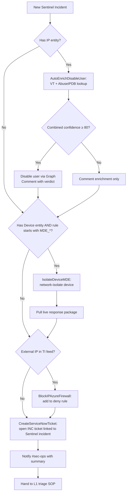

# SOAR Decision Flow

Every Sentinel incident in this pack is routed through the following decision pipeline before a human looks at it. Logic App playbooks live in `Playbooks/` and are bound to incident-creation via Sentinel automation rules.

## Top-level flow

## Per-rule automation matrix

| Rule | Auto-enrich | Auto-disable user | Auto-isolate device | Auto-block IP | Auto-ticket |
|---|:-:|:-:|:-:|:-:|:-:|
| EntraID_ImpossibleTravel | ✅ | ⚠️ at threshold | — | — | ✅ |
| EntraID_MFAFatigue | ✅ | ⚠️ at threshold | — | — | ✅ |
| EntraID_LegacyAuthSuccess | ✅ | — | — | — | ✅ |
| EntraID_ServicePrincipalCredAdd | — | — | — | — | ✅ (manual review only) |
| M365_InboxRuleExfil | ✅ | ⚠️ at threshold | — | — | ✅ |
| M365_MassSharePointDownload | — | — | — | — | ✅ |
| M365_OAuthConsentSuspiciousApp | — | — | — | — | ✅ (revoke is manual) |
| MDE_LOLBin_Rundll32_Network | ✅ | — | ✅ | ✅ | ✅ |
| MDE_MSHTA_RemoteScript | ✅ | — | ✅ | ✅ | ✅ |
| MDE_PowerShell_EncodedCommand | ✅ | — | ✅ | — | ✅ |
| Azure_NSG_OpenToInternet | — | — | — | — | ✅ (revert is manual) |
| Azure_KeyVault_SecretAccessSpike | ✅ | ⚠️ at threshold | — | — | ✅ |

⚠️ = action runs only when confidence threshold met; below threshold, playbook only enriches.

## Why "auto" stops where it does

Each row reflects a deliberate choice between **speed** and **reversibility cost**:

- **Enrich** — always safe, run everywhere.
- **Ticket** — always safe, run everywhere.
- **Isolate device** — reversible in seconds, low business impact for an L3-grade detection — auto.
- **Disable user** — annoying but reversible in minutes; require a confidence threshold.
- **Revoke OAuth consent / revert NSG / kill workload** — high business impact, manual approval.

The threshold parameter on `AutoEnrichDisableUser` lets the SOC adjust risk tolerance without code changes.

## Rule-level automation binding

In Sentinel → **Automation → Automation rules**:

| Trigger | Condition | Action |
|---|---|---|
| Incident created | Rule name matches `MDE_*` | Run playbook `IsolateDeviceMDE`, then `AutoEnrichDisableUser` |
| Incident created | Rule name matches `EntraID_*` or `M365_*` | Run playbook `AutoEnrichDisableUser` |
| Incident created | Severity = High or Critical | Run playbook `CreateServiceNowTicket` |
| Incident created | Tag contains `tor` or `c2-known` | Run playbook `BlockIPAzureFirewall` |

Order matters: enrichment must precede containment so confidence scores are available for threshold decisions.
